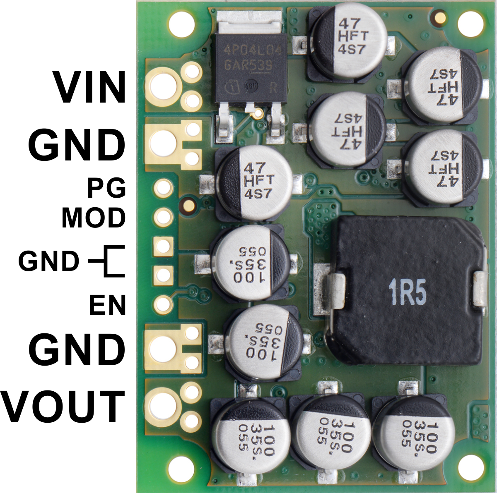
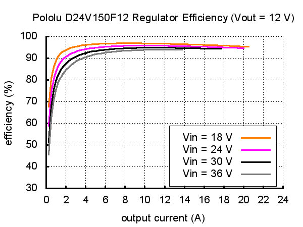

# Electrical

## Raspberry Pi

Adaptor board to connect the RPi to sensors/actuators

## Power

Power distribution board

### Pololu 12V Buck Regulator

# Bill of Materials (BoM)

| Part | Qnty | Each | Cost |
|---|---|---|---|
|  |  |  |  |
