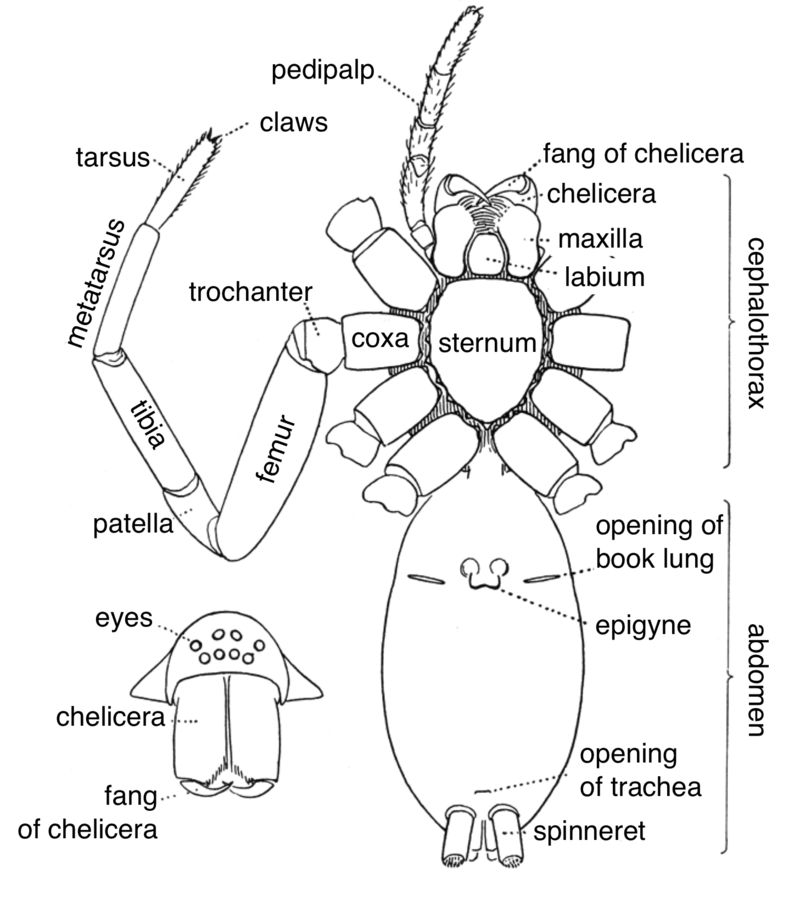
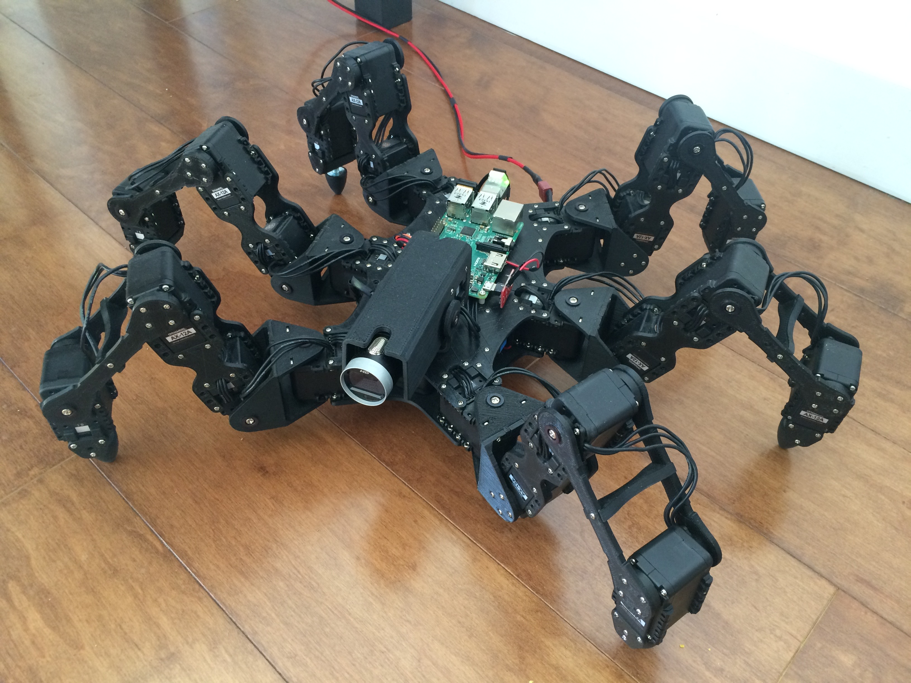

# AX-12A Mechanical Frame

Part names are based off of a traditional 8 legged spider. Yes, this one only
has 4 legs, but the parts are expensive, so cut me some slack.

## Sternum (body)

## Leg

### Leg Parts

- Coxa: red
- Femur: blue
- Tibia: yellow
- Tarsus: green

# Ideas

I saw [this](https://github.com/adammck/hexapod) design by Adam McKaig and
drew some ideas from it.

