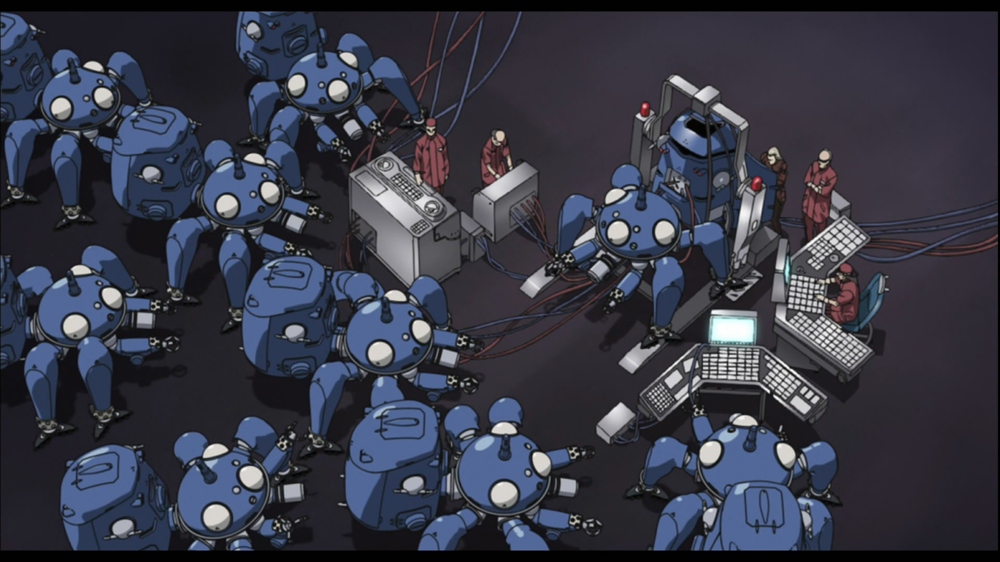
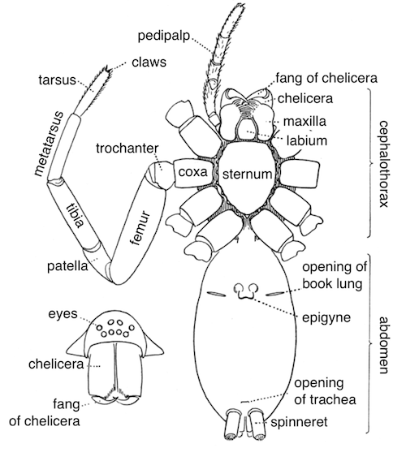
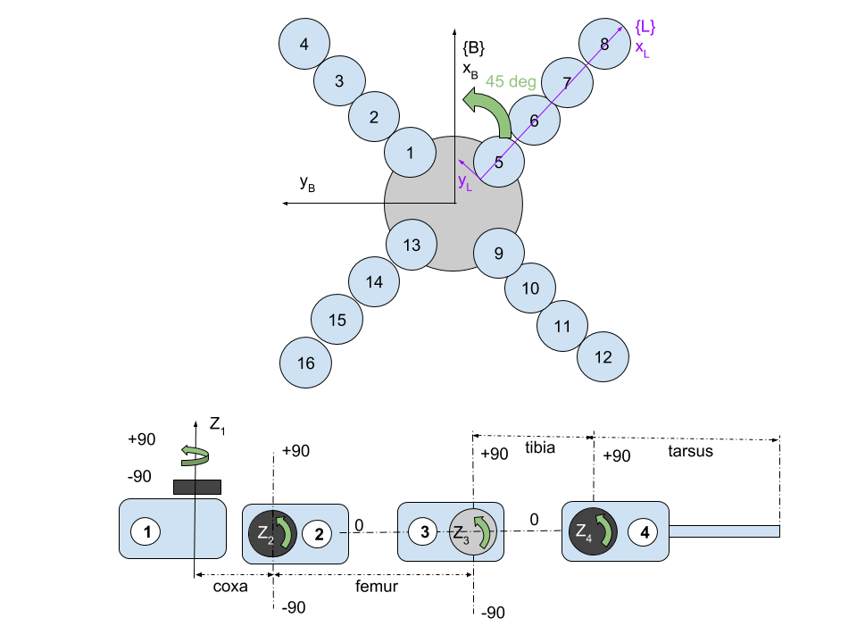
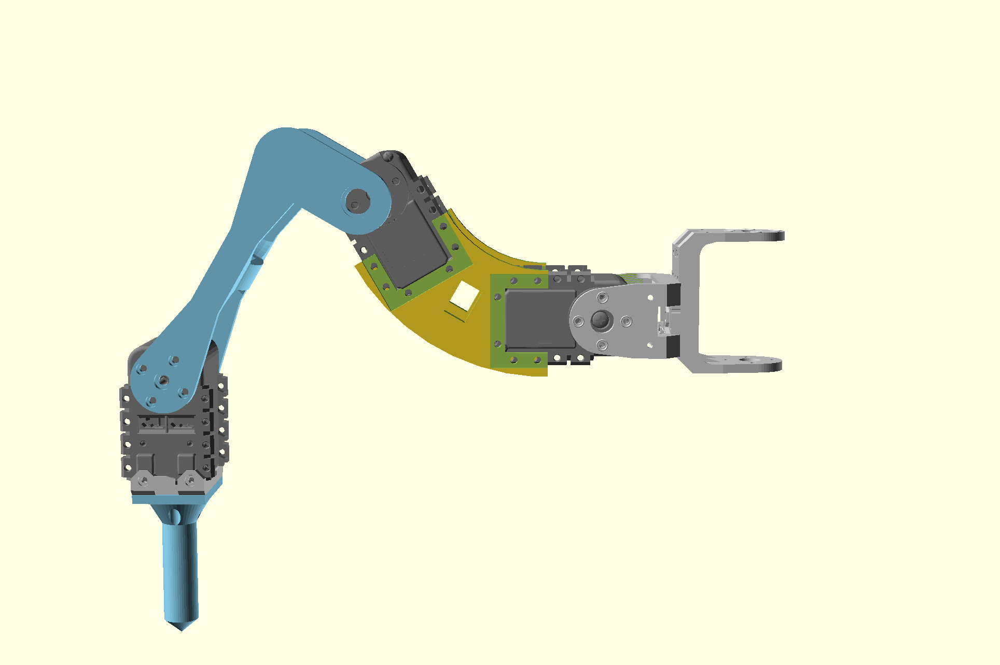
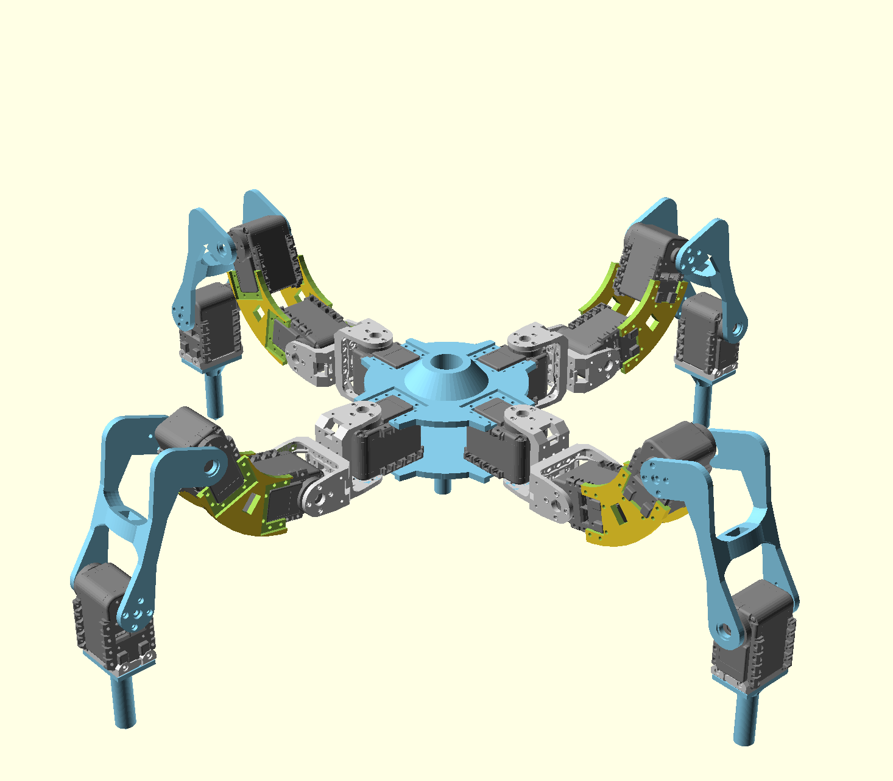
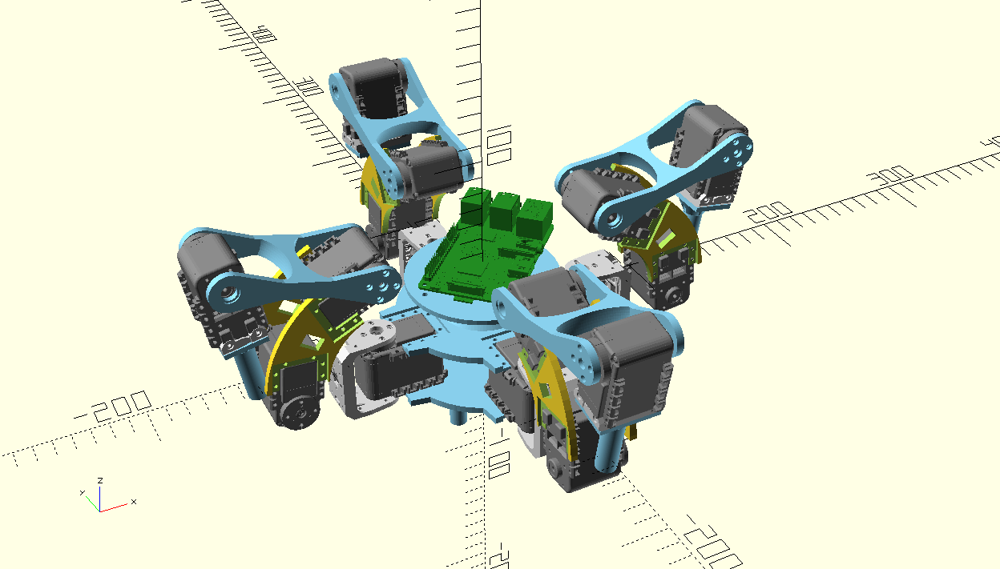
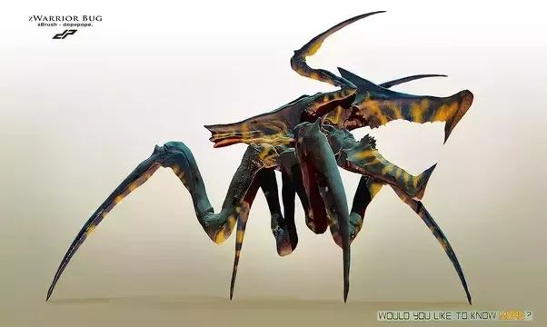
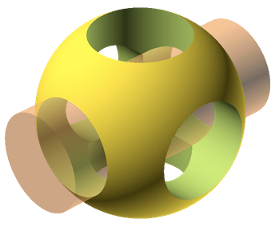

# AX-12A Mechanical Frame

This is sort of my poor man's tachikoma.

### Leg Parts

Part names are based off of a traditional 8 legged spider. Yes, this one only
has 4 legs, but the parts are expensive, so cut me some slack.

- Coxa: red
- Femur: blue
- Tibia: yellow
- Tarsus: green

Each of the legs has 4 addressable smart servos. Leg 1 for example, has servos 1,
2, 3, and 4. Each servo controls a degree of freedom for each leg.

## Sternum (body)

## Leg

## Assembled

The design below shows a new femur design where the part is curved. This
gives the robot a better leg orientation when in the stowed configuration
and the legs are up.

# Ideas

I saw [this](https://github.com/adammck/hexapod) design by Adam McKaig and
drew some ideas from it.

Also, I always thought the bugs from Starship Troopers were cool.

# Tools

I use [OpenSCAD](http://www.openscad.org/) which is a free solid modeler.

# Bill of Materials (BoM) for Hardware

| Part | Qnty | Each | Cost |
|------|------|------|------|
| AX-12A Servos x6 | 3 | $225  | $675 |
| 400 S1 (M2) screws | 1 | $5 | $5 |
| 400 N1 (M2) screws | 1 | $5 | $5 |
| BIOLOID BU/WA Washer/Bushing x10 | 2 | 8 | 16 |
| BOILOID 3Pin Cable Set (25) | 1 | $35 | $35 |
| BIOLOID F2 Servo Bracket x10 | 1 | $7 | $7 |
| BIOLOID F3 Servo Bracket x10 | 1 | $9 | $9 |
| PLA for 3d Printing | 1 | $25 | $25 |
