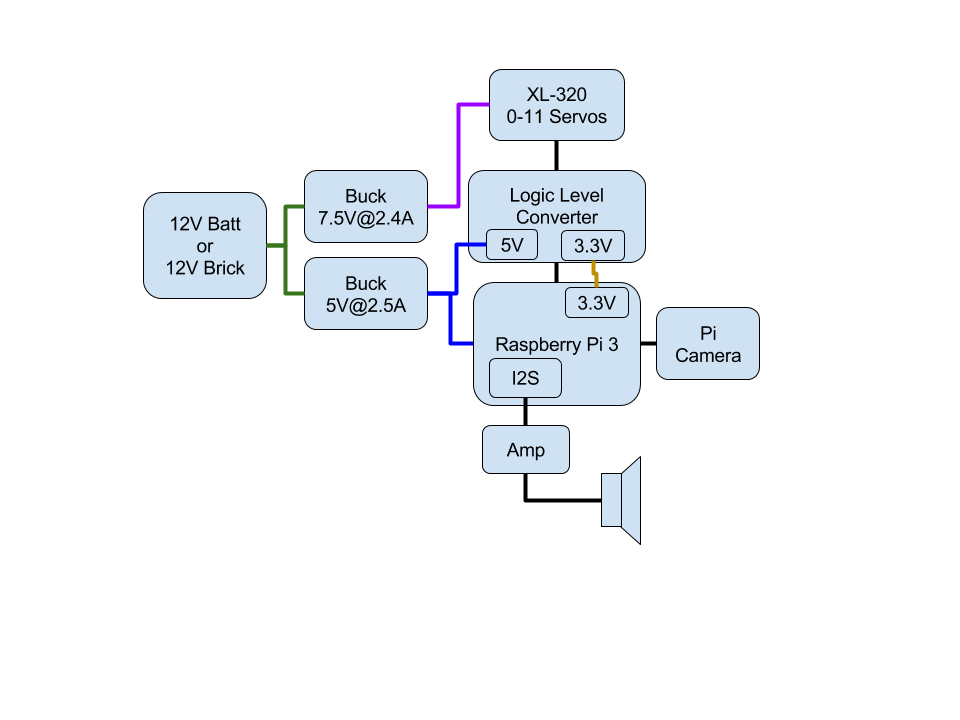

# Power System

## Voltage Converters

The main power is sized at 12V to provide xx W of power. Several highly
efficient buck converters are used to to translate the 12V into either
7.5V for the servos or 5V for the RPi.

### Servo Power

### RPi Power

## Power Budget

| Part          | Voltage (V) | Current (mA) | Power (W) |
|---            |---          |---           |---        |
| RPi           | 5           | 2000         | 10        |
| Pi Camera     |             |              |           |
| 5V Converter  | 7.5         |              |           |
| 7.5V Converter| 12          |              |           |
| xl-320 (x12)  | 7.5         | 1000         | 7.5 (xx)  |
| IMU           | 3.3         | x            |           |
| Audio Amp     | 5           | 600          | 3         |

---

	
	 This work is licensed under a <a rel="license" href="http://creativecommons.org/licenses/by-sa/4.0/">Creative Commons Attribution-ShareAlike 4.0 International License</a>.
