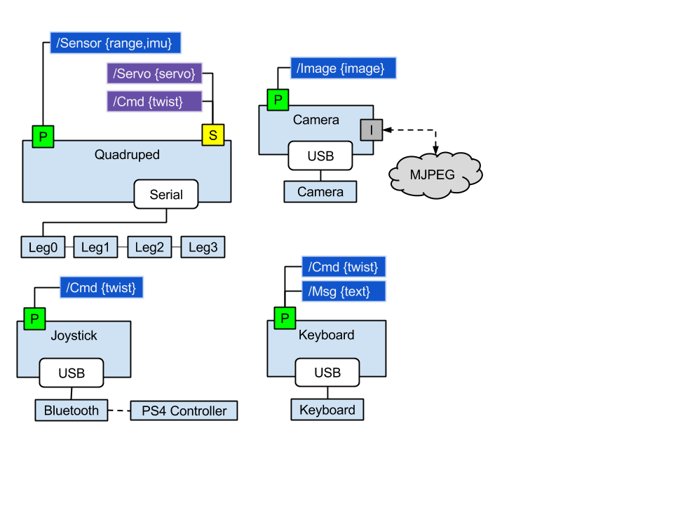

# Software

## PyGecko

This uses [PyGecko](https://github.com/walchko/pygecko)
(or [ROS](http://www.ros.org) if you write the interface). PyGecko is a simple ROS like system
written in python so it should run on anything python runs on.

	pip install pygecko

Follow the other installation instructions for pygecko, will requires
[ZeroMQ](http://zeromq.org/) and some other libraries to be installed to work.

Since pygecko (like ROS) is based on the idea of many simple/modular processes, there is
a `launch.py` file you run which will launch all of the necessary processes to get the 
robot running. If you don't need or want everything, you can just comment out what you
don't need.

## pyXL320

This software requires [pyxl320](https://pypi.python.org/pypi/pyxl320) to work
with the smart servos. You can install it with:

	pip install pyxl320

Since all of the leg servos are on the same RS845 bus, you will need to use
`set_id` to assign an *id* number to each servo **BEFORE** you hook them all
together. To see how to use it, type:

	set_id --help
	
## Other External Libraries

	pip install adafruit-lsm303

## Tests

`nose` is used for unit tests ... just run `nosetests -vs *.py`.

## Low Level Quadruped Driver

The class diagram only shows the main classes and important functions, there is more.
If you look in the `quadruped` folder, it contains the low level driver:

* Robot.py - main code to get things going ... adapt this to your needs.
* Quadruped.py - basic wrapper around leg and gait algorithms
* Leg.py - forward/reverse kinematics
* Gait.py - syncronization of how the 4 legs walk
* Servo.py - talks to the XL-320 smart servos
* ahrs - tilt compensated compass which gives roll, pitch, heading

---

	
	 This work is licensed under a <a rel="license" href="http://creativecommons.org/licenses/by-sa/4.0/">Creative Commons Attribution-ShareAlike 4.0 International License</a>.

