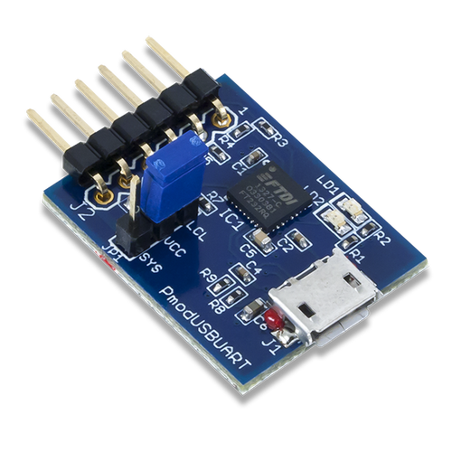

USB Serial
=============

RPi v3: ``/dev/tty.????``
OSX: ``/dev/tty.usbserial``

PmodUSBUART Pinout
-------------------------

=== ====== ===========================
Pin Signal Description
=== ====== ===========================
1   RTS    Ready to Send
2   RXD    Receive
3   TXD    Transmit
4   CTS    Clear to Send
5   GND    Ground
6   3V3    Power
=== ====== ===========================

Other
----------

=== === ======================================================

=== === ======================================================
JP1 SYS Powered by FTDI chip, supplies power to remote board
JP1 LCL If remote board is powered, use this setting
LED 1   Data transfer from host computer USB to UART
LED 2   Data transfer from UART to host computer USB
=== === ======================================================
