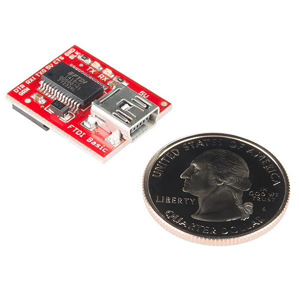

# USB Serial

I am using a [Sparkfun USB-to-serial converter with 5V logic](https://www.sparkfun.com/products/9716)
to talk to the servos. It has the following pins broken out:

- DTR
- RX in
- TX out
- 5V
- CTS
- Ground

Also, this is a **real FTDI board**, so you don't need to compile and install drivers.
