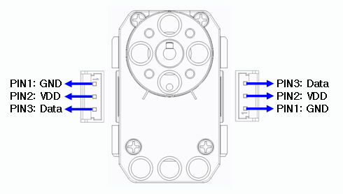

# Robotis - Dynamixel XL-320

The XL-320 servo from ROBOTIS is so small you might mistake it for an ordinary hobby servo, but you would be missing out! Despite its diminutive size, it is actually one of the newest models in the DYNAMIXEL robot servo line from ROBOTIS.

Each XL-320 can produce up to 0.39 N-m (55 in-oz) of torque and rotate at 114 RPM in precisely controlled 0.29° increments. For its size (24 x 36 x 27 mm) and weight (16.7 g) there is no other servo that can compete with the XL-320 in performance and durability. The XL-320 has all the most important features of larger DYNAMIXEL servos in a much smaller package.

## Features

Position, temperature, load, and input voltage feedback
PID control for high accuracy
7.4 V recommended input voltage
TTL communication for easy daisy chaining
24 x 36 x 27 mm compact size
16.7 g weight
Embedded 238:1 gear reduction with built in safety clutch
3 color programmable LEDs

Like other DYNAMIXEL Robot Actuators, XL-320 servos are network driven using the TTL communication protocol, which means they can each be addressed with a unique ID. By default, each servo come set to ID #1 and at 1 Mbps baud rate. Be sure to change those to suit your needs if you connect more than one XL-320 together. The ID can be set dynamically, making it easy for users to configure their actuators for their specific robot. The 100 mm cable included with each servo can be used to daisy chain the servos for easy construction of complex humanoid robots like the DARWIN Mini which uses 16 XL-320 servos to achieve amazing life-like movements and gestures.

## Parts

Plenty of support material is available for the XL-320 including complete documentation, specifications, software downloads, and 3D CAD models.

If you want to make your own cables for this servos here are the part numbers for the MOLEX connectors

- PCB Header (servo side) MOLEX 53253-0370
- Cable (white housing) MOLEX 51065-0300
- Cable (crimping pins) MOLEX 50212-8000
