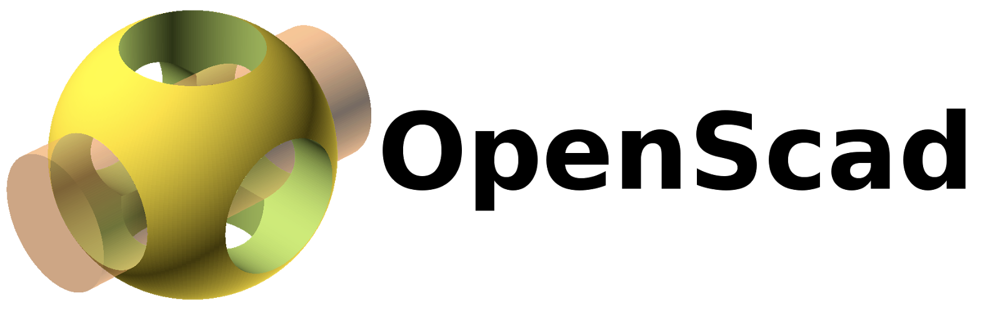
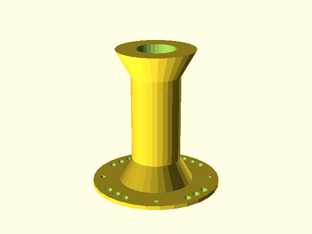
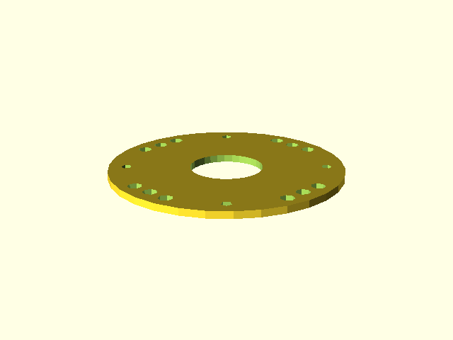
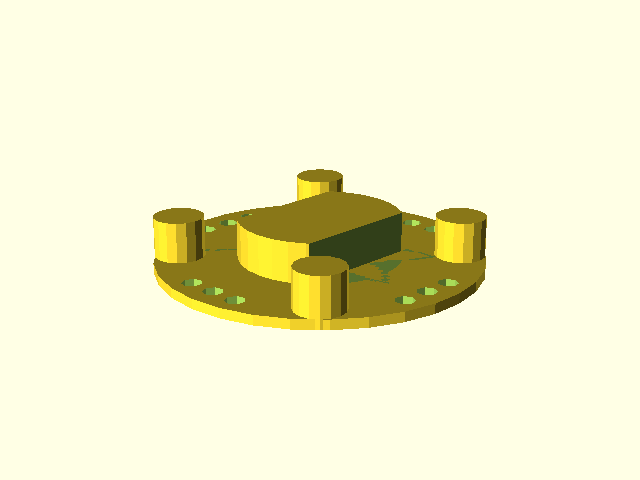
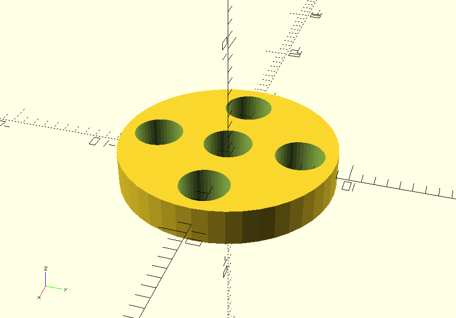
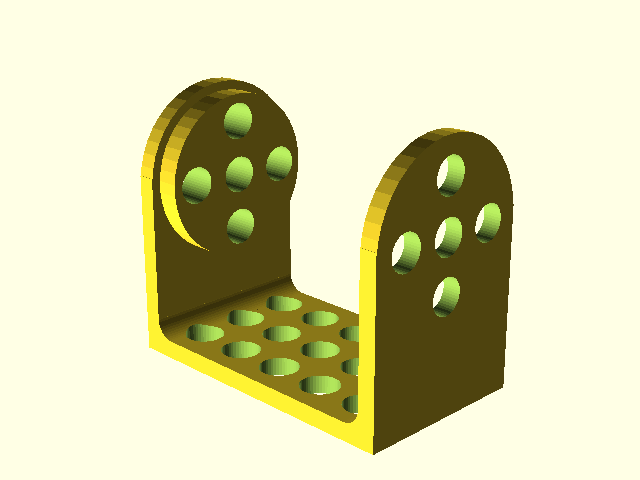

These models were created by me (Kevin Walchko). Since OpenSCAD is setup like
a programming language, you can adjust the parameters of some of the parts to
you liking.

# Hardware

This are still being developed. If they are not current, github is able to render the stl files and show the current version.

## To Do

- Need to design the head, which holds the pi and other electronics

## Top Plate

## Middle Plate

## Bottom Plate

## Pulley

## Servo Bracket

# macOS Install

Do not use `brew` to install, there are issues with the Qt library that are a
pain-in-the-ass! Best to just get it from the website: http://www.openscad.org/downloads.html

## License:

 This work is licensed under a <a rel="license" href="http://creativecommons.org/licenses/by-sa/4.0/">Creative Commons Attribution-ShareAlike 4.0 International License</a>.
