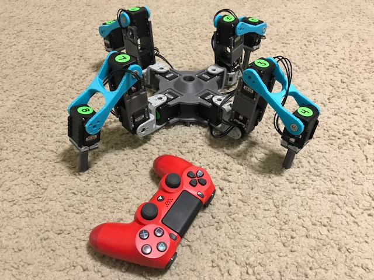
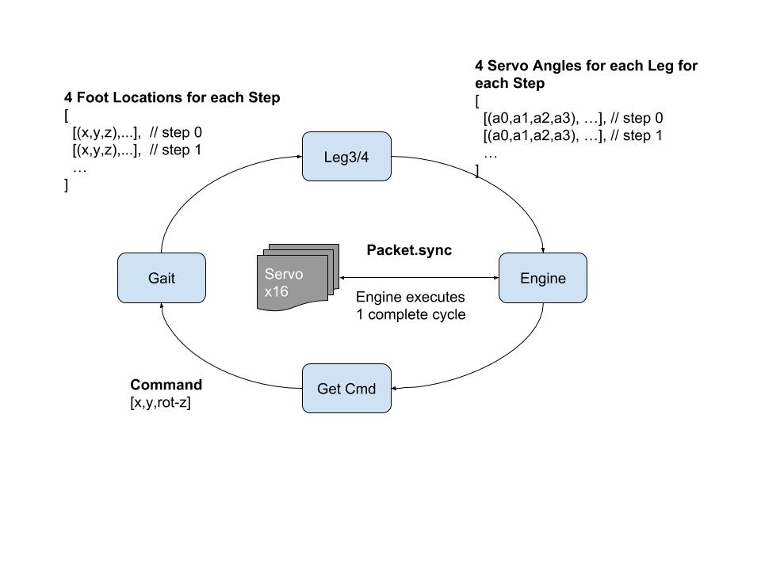

# Quadruped

[](https://github.com/MultipedRobotics/multiped)
[](https://github.com/MultipedRobotics/multiped)

My walking robot software.

[Robot based on Robotis XL320 Servos](https://github.com/MultipedRobotics/quadruped-XL320):

* [YouTube](https://www.youtube.com/watch?v=kH2hlxUfCNg)
* [Vimeo](https://player.vimeo.com/video/194676675)

[Robot based on Robotis AX12 Servos](https://github.com/MultipedRobotics/quadruped-AX12)

* Not fully working yet

## Required Software

This software requires [`pyservos`](https://github.com/MomsFriendlyRobotCompany/pyservos)
to run. This software talks to both the XL-320 and AX-12A servos from Robotis.

# Class Layout

Here is *sort* of the layout of the code:

```
      cmd      3d pts      DH angles        servo packet
robot --> gait -----> legs --------> engine -----------> servos
```

- **Robot(data):**
    - Holds all of the other classes: Kinematics, Gait, Engine
    - Holds all sensors
    - Runs any logic/AI for the robot
- **Gait:**
    - Gait calculates the foot positions for 1 cycle of a movement
        - All values are in (x,y,z) of units mm
    - command() - plans all feet through 1 gait cycle (say 15 steps)
- **Engine:**
    - Engine takes the output from kinematics and translates it to servo space
      for each time stop and each leg in the cycle. It then sends the commands
      (in bulk) to move the servos each step
      - legs[4]
          - servos[3-4]
              - current angle
              - ID
              - angle offset (based on kinematics to align with DH reference frame)
- **Kinematics:**
    Takes the 3d positions from gait and performs the inverse kinematics
    - leg parts: coxa, femur, tibia, *[tarsus]*
    - *forward()* - forward kinematics
    - *inverse()* - inverse kinematics

The example quadruped (in the examples folder), takes a dictionary (or you can
use a json file). Currently it takes:

```json
data = {
    "numLegs": 4,
    "numServosPerLeg": 4,
    "coxa":   [52, 150],
    "femur":  [90, 123],
    "tibia":  [89, 194],
    "tarsus": [90, 167],

    "sit": [80, 0, 1],
    "stand": [120, 0, -70],

    "servoType": 1,
    "bcm_pin": 11,
    "serialPort": "/dev/tty.usbserial-AL034G2K"
}
```

If you don't pass it a serial port, then it falls back to a simulated serial
port which does nothing but is useful for testing.

## Bulk Writing

Normally, you would send an individual command to each servo and get a response
back from it. That creates a lot of back an forth communications. Instead,
this uses a bulk write to send commands to all 12 servos at once with no reply.
This results in smoother motion and greatly reduced data transmission.

## Building and Documentation

Details for how to build the robot and other information are in the `docs` folder
in the [git repo](https://github.com/MomsFriendlyRobotCompany/quadruped/tree/master/docs)

# Tools

This directory contains several tools for the robot:

- get_leg_angles.py: prints out the joint angles for all 4 legs

```bash
$ ./get_leg_angles.py /dev/tty.usbserial-AL034G2K
Opened /dev/tty.usbserial-AL034G2K @ 1000000

Servos: 1 - 12
All angles are in degrees
         Leg 1 |         Leg 2 |         Leg 3 |         Leg 4 |
   ID | Angle  |   ID | Angle  |   ID | Angle  |   ID | Angle  |
-----------------------------------------------------------------
    1 | 149.56 |    4 | 149.56 |    7 | 149.56 |   10 | 149.56
    2 | 239.88 |    5 | 271.55 |    8 | 269.79 |   11 | 270.38
    3 |  99.41 |    6 | 100.29 |    9 | 100.00 |   12 |  99.41
-----------------------------------------------------------------
```

- get_leg_info.py: prints out servo information for all 12 servos on the robot


```bash
$ ./get_leg_info.py /dev/tty.usbserial-AL034G2K
Opened /dev/tty.usbserial-AL034G2K @ 1000000

Servos: 1 - 12
--------------------------------------------------
Servo: 1          HW Error: 0
Position [deg]: 149.6  Load:   0.0% CCW
Voltage [V]  7.0     Temperature [F]:  80.6
--------------------------------------------------
Servo: 2          HW Error: 0
Position [deg]: 239.6  Load:   0.0% CCW
Voltage [V]  7.2     Temperature [F]:  80.6
--------------------------------------------------
Servo: 3          HW Error: 0
Position [deg]:  99.4  Load:   0.0% CCW
Voltage [V]  7.2     Temperature [F]:  82.4
--------------------------------------------------
Servo: 4          HW Error: 0
Position [deg]: 149.6  Load:   0.0% CCW
Voltage [V]  7.3     Temperature [F]:  80.6
--------------------------------------------------
Servo: 5          HW Error: 0
Position [deg]: 271.6  Load:   0.0% CCW
Voltage [V]  7.2     Temperature [F]:  80.6
--------------------------------------------------
Servo: 6          HW Error: 0
Position [deg]: 100.3  Load:   0.0% CCW
Voltage [V]  7.4     Temperature [F]:  82.4
--------------------------------------------------
Servo: 7          HW Error: 0
Position [deg]: 149.6  Load:   0.0% CCW
Voltage [V]  7.2     Temperature [F]:  80.6
--------------------------------------------------
Servo: 8          HW Error: 0
Position [deg]: 269.8  Load:   0.0% CCW
Voltage [V]  7.1     Temperature [F]:  78.8
--------------------------------------------------
Servo: 9          HW Error: 0
Position [deg]:  99.4  Load:   0.8% CCW
Voltage [V]  7.2     Temperature [F]:  82.4
--------------------------------------------------
Servo: 10          HW Error: 0
Position [deg]: 149.9  Load:   0.0% CCW
Voltage [V]  7.1     Temperature [F]:  80.6
--------------------------------------------------
Servo: 11          HW Error: 0
Position [deg]: 270.1  Load:   0.0% CCW
Voltage [V]  7.2     Temperature [F]:  80.6
--------------------------------------------------
Servo: 12          HW Error: 0
Position [deg]:  99.4  Load:   0.0% CCW
Voltage [V]  7.1     Temperature [F]:  84.2
--------------------------------------------------
```

## History

### RC Servos


This was the original version, shown above around Aug 2016. It used toy RC
servos (9 g's), they didn't work that great.

### XL-320 Servos


**work on this robot has stopped**

### AX-12A Servos



**this is the current robot I am focusing on**

## Software




# ToDo

- change more return values to `tuples` instead of `lists` for performance
- do CM shifting
- make generic, so I can do 6 or 8 legs
- flush out the config file better, I have hard coded too many things

# Change Log

| Date | Version | Notes |
|---|---|---|
| 2018-11-27 | 0.6.0 | Reorg'd, moved robots to own repo |
| 2017-12-25 | 0.5.0 | Clean up and reorg, removed unnecessary libraries |
| 2017-06-07 | 0.4.1 | broke out into package and published to PyPi |
| 2016-08-10 | 0.0.1 | init |


# MIT Software License

**Copyright (c) 2016 Kevin J. Walchko**

Permission is hereby granted, free of charge, to any person obtaining a copy of
this software and associated documentation files (the "Software"), to deal in
the Software without restriction, including without limitation the rights to
use, copy, modify, merge, publish, distribute, sublicense, and/or sell copies
of the Software, and to permit persons to whom the Software is furnished to do
so, subject to the following conditions:

The above copyright notice and this permission notice shall be included in all
copies or substantial portions of the Software.

THE SOFTWARE IS PROVIDED "AS IS", WITHOUT WARRANTY OF ANY KIND, EXPRESS OR
IMPLIED, INCLUDING BUT NOT LIMITED TO THE WARRANTIES OF MERCHANTABILITY, FITNESS
FOR A PARTICULAR PURPOSE AND NONINFRINGEMENT. IN NO EVENT SHALL THE AUTHORS OR
COPYRIGHT HOLDERS BE LIABLE FOR ANY CLAIM, DAMAGES OR OTHER LIABILITY, WHETHER
IN AN ACTION OF CONTRACT, TORT OR OTHERWISE, ARISING FROM, OUT OF OR IN
CONNECTION WITH THE SOFTWARE OR THE USE OR OTHER DEALINGS IN THE SOFTWARE.

---

<p align="center">
    <a rel="license" href="http://creativecommons.org/licenses/by-sa/4.0/">
        
    </a>
    <br />This work is licensed under a <a rel="license" href="http://creativecommons.org/licenses/by-sa/4.0/">Creative Commons Attribution-ShareAlike 4.0 International License</a>.
</p>
